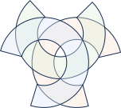

<p align="center">
  
</p>
<h3 align="center">Forge</h3>
<p align="center">AI-native smart contract studio for CreditChain.</p>
    
<div align="center">


[](https://github.com/openibank/forge/blob/forge/main/LICENSE)
[](https://creditchain.org)
[](https://forge.creditchain.org)

</div>

## Forge

**Forge** is the CreditChain-native smart contract development cloud, forked from Ethereum Remix. It keeps Remix's battle-tested Solidity IDE, plugin engine, compiler, debugger, testing, and deployment foundation while adding CreditChain-first networks, templates, verified contract import, AI-assisted engineering, audit workflows, deployment verification, and future Contract Passport infrastructure.

Primary product identity:

- Product: Forge
- Domain: [https://forge.creditchain.org](https://forge.creditchain.org)
- Repository: [https://github.com/openibank/forge](https://github.com/openibank/forge)
- Deployment repository: [https://github.com/openibank/openibank.github.io](https://github.com/openibank/openibank.github.io)
- Upstream baseline: Ethereum Remix
- Positioning: AI-native smart contract studio for CreditChain

## CreditChain MVP

The first Forge milestone is a safe product-facing rebrand plus CreditChain foundations:

- Visible app branding says Forge.
- CreditChain mainnet, testnet, and local devnet configs live in `libs/forge/creditchain-config`.
- The home screen exposes CreditChain quick actions.
- The template picker includes CreditChain-native starting points.
- The local filesystem daemon is packaged as `@creditchain/forged` with the `forged` command.
- Local packages use CreditChain-scoped Forge names such as `@creditchain/forge-solidity`, `@creditchain/forge-api`, and `@creditchain/forged`.


## Forge Package Identity

Forge is now branded and packaged as a CreditChain project. Local apps and libraries use `forge-*` folders, Nx project names, and `@creditchain/*` import aliases. The only remaining `@remixproject/*` packages are upstream plugin engine dependencies used by the runtime protocol.

## Forge Libraries
Forge libraries power the native plugins. Read more about libraries [here](libs/README.md)

## Offline Usage

Forge production builds are published for `forge.creditchain.org`. To use Forge offline, build this repository locally and serve `dist/apps/forge-ide`.

Note: It contains the latest supported version of Solidity available at the time of the packaging. Other compiler versions can be used online only.


## Setup

* Install **Yarn** and **Node.js**. See [Guide for NodeJs](https://docs.npmjs.com/downloading-and-installing-node-js-and-npm) and [Yarn install](https://classic.yarnpkg.com/lang/en/docs/install)<br/>
*Supported versions:*
```bash
"engines": {
    "node": "^20.0.0",
    "npm": "^6.14.15"
  }
```
* Install [Nx CLI](https://nx.dev/using-nx/nx-cli) globally to enable running **nx executable commands**.
```bash
yarn global add nx
```
* Clone the GitHub repository (`wget` need to be installed first):

```bash
git clone https://github.com/openibank/forge.git
```
* Build and Run `forge`:

1. Move to project directory: `cd forge`
2. Install dependencies: `yarn install` or simply run `yarn`
3. Build Forge libraries: `yarn run build:libs`
4. Build Forge project: `yarn build`
5. Build and run project server: `yarn serve`. Optionally, run `yarn serve:hot` to enable hot module to reload for frontend updates.

Open `http://127.0.0.1:8080` in your browser to load Forge locally.

Go to your `text editor` and start developing. The browser will automatically refresh when files are saved.

## Production Build
To generate React production builds for Forge.
```bash
yarn run build:production
```
Build can be found in `forge/dist/apps/forge-ide` directory.

Deploy the production artifact to GitHub Pages:

```bash
yarn deploy:forge:pages
```

```bash
yarn run serve:production
```
Production build will be served by default to `http://localhost:8080/` or `http://127.0.0.1:8080/`

## Nx Cloud caching

This repo uses Nx Cloud to speed up builds and keep CI deterministic via remote caching.

- Configuration: `nx.json` uses the Nx Cloud runner and reads the token from the `NX_CLOUD_ACCESS_TOKEN` environment variable.
- CI: CircleCI jobs automatically use `--cloud` when the token is present; for forked PRs (no secrets), they fall back to local-only caching. Build logs are stored under `logs/nx-build.log`.
- Verifying locally: run the same target twice; the second run should print “Nx read the output from the cache”. Example: `nx run forge-ide:build` and run it again.
- Insights: View cache analytics and run details at https://nx.app (links appear in Nx output when the token is configured).

## Docker:

Prerequisites: 
* Docker (https://docs.docker.com/desktop/)
* Docker Compose (https://docs.docker.com/compose/install/)

### Run with docker

Build the local Forge image from this repository:

```
docker build -t creditchain/forge-ide .
docker run -p 8080:80 creditchain/forge-ide
```

Official Forge container publishing will use the `creditchain/forge-ide` image name.

### Run with docker-compose:

To run locally without building you only need docker-compose.yaml file and you can run:

```
docker-compose pull
docker-compose up -d
```

Then go to http://localhost:8080 and you can use your Forge instance.

To fetch the docker-compose file without cloning this repo run:
```
curl https://raw.githubusercontent.com/openibank/forge/master/docker-compose.yaml > docker-compose.yaml
```

### Troubleshooting

If you have trouble building the project, make sure that you have the correct version of `node`, `npm` and `nvm`. Also, ensure [Nx CLI](https://nx.dev/using-nx/nx-cli) is installed globally.

Run:

```bash
node --version
npm --version
nvm --version
```

In Debian-based OS such as Ubuntu 14.04LTS, you may need to run `apt-get install build-essential`. After installing `build-essential`, run `npm rebuild`.

## Unit Testing

Run the unit tests using library name like: `nx test <project-name>`

For example, to run unit tests of `forge-analyzer`, use `nx test forge-analyzer`

## Browser Testing

To run the tests via Nightwatch:

 - Install webdrivers for the first time: `yarn install_webdriver`
 - Build & Serve Remix: `yarn serve`

        
**NOTE:**

- **The `ballot` tests suite** requires running `ganache` locally.

- **The `remixd` tests suite** requires running `remixd` locally.

- **The `gist` tests suite** requires specifying a GitHub access token in **.env file**. 
```
    gist_token = <token> // token should have permission to create a gist
```

There is a script to allow selecting the browser and a specific test to run:

```
yarn run select_test
```

You need to have 

- selenium running 

- the IDE running

- optionally have remixd or ganache running

### Splitting tests with groups

Groups can be used to group tests in a test file together. The advantage is you can avoid running long test files when you want to focus on a specific set of tests within a test file.

These groups only apply to the test file, not across all test files. So for example group1 in the ballot is not related to a group1 in another test file.

Running a group only runs the tests marked as belonging to the group + all the tests in the test file that do not have a group tag. This way you can have tests that run for all groups, for example, to perform common actions.

There is no need to number the groups in a certain order. The number of the group is arbitrary.

A test can have multiple group tags, this means that this test will run in different groups.

You should write your tests so they can be executed in groups and not depend on other groups.

To do this you need to:

- Add a group to tag to a test, they are formatted as #group followed by a number: so it becomes #group1, #group220, #group4. Any number will do. You don't have to do it in a specific order. 

```
  'Should generate test file #group1': function (browser: NightwatchBrowser) {
    browser.waitForElementPresent('*[data-id="verticalIconsKindfilePanel"]')
```

- add '@disabled': true to the test file you want to split:

```
module.exports = {
  '@disabled': true,
  before: function (browser: NightwatchBrowser, done: VoidFunction) {
    init(browser, done) // , 'http://localhost:8080', false)
  },
```
- change package JSON to locally run all group tests (point to appropriate config file depending on environment):

```
    "nightwatch_local_debugger": "yarn run build:e2e && nightwatch --config dist/apps/forge-ide-e2e/nightwatch-chrome.js dist/apps/forge-ide-e2e/src/tests/debugger_*.spec.js --env=chrome",
```

- run the build script to build the test files if you want to run the locally

```
yarn run build:e2e
```

### Locally testing group tests

You can tag any test with a group name, for example, #group10 and easily run the test locally.

- make sure you have nx installed globally
- group tests are run like any other test, just specify the correct group number

#### method 1

This script will give you an options menu, just select the test you want
```
yarn run select_test
```

### Run the same (flaky) test across all instances in CircleCI

In CircleCI all tests are divided across instances to run in parallel. 
You can also run 1 or more tests simultaneously across all instances.
This way the pipeline can easily be restarted to check if a test is flaky.

For example:

```
  'Static Analysis run with remixd #group3 #flaky': function (browser) {
```

Now, the group3 of this test will be executed in firefox and chrome 80 times.
If you mark more groups in other tests they will also be executed. 

**CONFIGURATION**

It's important to set a parameter in the .circleci/config.yml, set it to false then the normal tests will run.
Set it to true to run only tests marked with flaky.
```
parameters:
  run_flaky_tests:
    type: boolean
    default: true
```

## Important Links

- Official website: https://forge.creditchain.org
- CreditChain: https://creditchain.org
- Official documentation: https://forge.creditchain.org/docs
- Forge repository: https://github.com/openibank/forge
- Forge deployment repository: https://github.com/openibank/openibank.github.io
- CreditChain updates: https://creditchain.org/blog
- X: https://x.com/CreditChain
- Community: https://forge.creditchain.org/community
