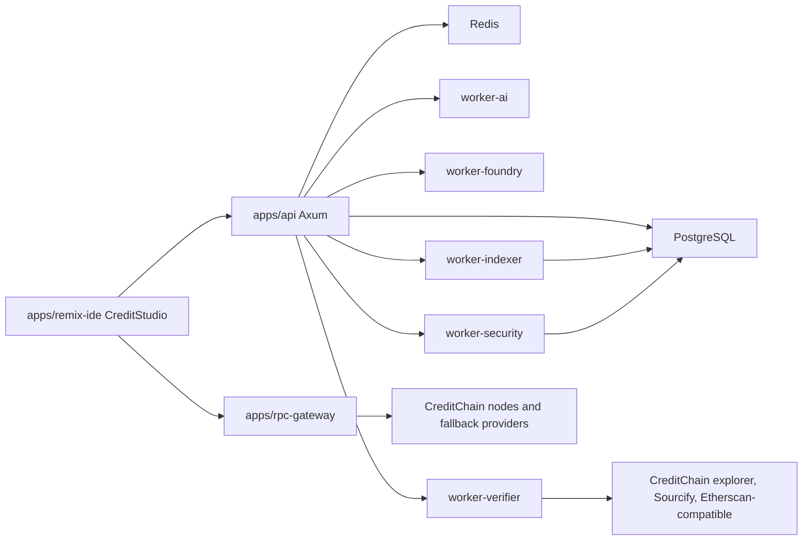

# CreditForge Architecture

CreditForge is a modular platform for AI-native EVM development and CreditChain
infrastructure. The architecture separates user-facing workspaces from execution,
security scanning, indexing, RPC routing, and deployment approvals.

## Modules

- CreditRPC: API-key authenticated JSON-RPC and WebSocket gateway with upstream
  routing, quota, method policy, caching, failover, and latency telemetry.
- CreditSearch: contract/source discovery over addresses, explorer URLs, ABIs,
  bytecode, function selectors, npm packages, GitHub, Sourcify, Blockscout, and
  CreditChain explorer data.
- SourcePull: verified source importer that reconstructs Foundry projects and
  records source status, compiler settings, ABI, bytecode hash, license, proxy
  metadata, libraries, constructor args, and diagnostics.
- CreditStudio: browser workspace with file tree, Monaco editor, terminal output,
  AI panel, compile/test/security results, deployment panel, GitHub sync, and
  read/write contract UI.
- ForgeAgent: tool-driven AI contract engineer. It follows Understand -> Plan ->
  Patch -> Compile -> Test -> Audit -> Deploy -> Verify -> Monitor.
- CreditBeacon: security engine for Slither, Foundry tests, fuzzing, custom
  heuristics, AI review, admin-risk analysis, proxy risk, and license risk.
- CreditDeploy: deployment simulation, wallet signing, testnet/mainnet approval,
  verification, ABI publishing, read/write UI, events, and monitoring.
- CreditHouse: curated templates and CreditChain-native protocol library.
- CreditIndex: block, transaction, log, token transfer, NFT transfer, balance,
  address activity, decoded event, and webhook trigger indexing.
- CreditDocs: generated docs, ABI clients, SDK snippets, and deployment notes.
- CreditKeys: users, teams, projects, API keys, quota, usage, and billing shell.
- News Center: public market/news intelligence that maps crypto and capital
  market motion into builder actions, templates, scans, and infrastructure
  priorities.

## Service Topology

## Data Flow

1. A project creates API keys through CreditKeys. Only key hashes are persisted.
2. CreditRPC authenticates requests, applies method policy, routes upstream, and
   writes operational metadata to `rpc_requests`.
3. CreditSearch ranks source candidates. Exact bytecode-matched verified source
   and Sourcify full matches rank above explorer, GitHub, npm, similar source,
   and decompiled approximations.
4. SourcePull reconstructs a Foundry workspace and creates `contract_sources`,
   `contract_files`, `contract_abis`, `workspaces`, and `workspace_files`.
5. ForgeAgent requests workspace-scoped reads/writes, patches files, then invokes
   compile/test/security tools. Deployment tools require explicit approval.
6. CreditBeacon writes normalized `security_reports` and `security_findings`.
7. CreditDeploy simulates, deploys, verifies, and stores `deployments`,
   `contract_deployments`, and `contract_verifications`.
8. CreditIndex ingests chain data and triggers webhooks through
   `webhook_deliveries`.

## Execution Boundary

Build, test, fuzz, and scanner jobs run outside the API process. The MVP sandbox
is Docker with a workspace-only mount, CPU/memory/time limits, no default network,
redacted logs, and artifact capture. The long-term runtime is Firecracker or a
similar microVM isolation layer.

## Deployment Plan

- Web: static/Node deployment behind `forge.creditchain.org`.
- API: Rust Axum service behind `api.creditchain.org`.
- RPC gateway: Rust service behind `rpc.creditchain.org` with HTTP and WS.
- Beacon: scanner workers behind `beacon.creditchain.org`.
- House: template marketplace routes under `house.creditchain.org`.
- Docs: docs site under `docs.creditchain.org`.
- Postgres, Redis, object storage, and worker queues are required for production.
- Route 53 DNS automation is provided for `forge.creditchain.org`; production
  requires a real hosting target such as CloudFront, Vercel, or an ALB.

## Observability

Every service should emit structured logs, request IDs, OpenTelemetry traces,
Prometheus metrics, worker job status, and audit logs for sensitive actions.
Important metrics include RPC latency/error rates, build/test/scan duration,
verification success, deployment success, webhook delivery success, and AI
tool-call success.
